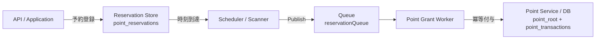

# ポイント付与予約システム内部設計書

ポイント付与予約機能を「同期API＋非同期処理＋冪等性＋再実行前提」で実装したシステムの詳細ドキュメントです。

---

## 1. アーキテクチャ概要

予約リクエストを同期的に受け付け、実際の付与処理は非同期で行うことで、高負荷時のレスポンス性能と可用性を確保しています。また、冪等性を担保することで、ワーカーの再実行や障害時のリカバリを容易にしています。



---

## 2. 主要設計ポイント

### 2.1 冪等性の実現 (Idempotency)

Workerがメッセージを重複して受信した場合や、処理途中で失敗して再試行された場合でも、ポイントが二重に付与されないことを保証します。

```sql
-- point_transactions テーブルで重複を防止
INSERT IGNORE INTO point_transactions 
  (id, idempotency_key, user_id, point_amount, created_at)
VALUES (?, ?, ?, ?, ?)
```

- **仕組み**: `point_transactions` テーブルの `idempotency_key` (UNIQUE制約) を利用。
- **挙動**: `INSERT IGNORE` (または `ON CONFLICT DO NOTHING`) が成功した（＝新規処理）場合のみ、ポイント残高テーブル `point_root` を更新します。失敗した（＝処理済み）場合は、何もせずに正常終了として扱います。

### 2.2 状態遷移 (State Transition)

予約の状態は以下のように遷移します。

```
PENDING (待機中)
   ↓ スケジューラがPick
PROCESSING (処理中 / Queue送信済み)
   ↓ Workerが処理
DONE (完了)  or  FAILED (失敗)
```

---

## 3. 実装詳細

### 3.1 データベーススキーマ

既存の `point_root` に加え、以下の2テーブルを追加しました。

#### `point_reservations` (予約テーブル)
予約リクエストを永続化します。

```sql
CREATE TABLE point_reservations (
    id VARCHAR(36) PRIMARY KEY,
    user_id VARCHAR(20) NOT NULL,
    point_amount INT NOT NULL,
    execute_at TIMESTAMP NOT NULL,
    status VARCHAR(20) NOT NULL DEFAULT 'PENDING',
    idempotency_key VARCHAR(100) UNIQUE NOT NULL,
    created_at TIMESTAMP NOT NULL,
    updated_at TIMESTAMP NOT NULL,
    INDEX idx_execute_status (execute_at, status)
);
```

#### `point_transactions` (トランザクション履歴・冪等性管理)
ポイント付与の実行履歴を管理し、重複付与を防ぎます。

```sql
CREATE TABLE point_transactions (
    id VARCHAR(36) PRIMARY KEY,
    idempotency_key VARCHAR(100) UNIQUE NOT NULL, -- 冪等性保証の核
    user_id VARCHAR(20) NOT NULL,
    point_amount INT NOT NULL,
    created_at TIMESTAMP NOT NULL
);
```

### 3.2 コンポーネント構成

| コンポーネント | ファイル | 役割 |
|---|---|---|
| Domain | `internal/domain/reservation.go` | 予約モデル、ステータス定数の定義 |
| Repository | `internal/infra/repository/reservation_mysql.go` | 予約データのCRUD、ステータス更新 |
| Repository | `internal/infra/repository/point_mysql.go` | **AddPointIdempotent** メソッドによる冪等付与の実装 |
| Usecase | `internal/usecase/reservation_create.go` | 予約登録ロジック、バリデーション |
| API Handler | `internal/presentation/point_handler.go` | `POST /point/reserve` エンドポイント |
| Message Queue | `internal/infra/aync/mq/rabbit_producer.go` | RabbitMQへのメッセージ送信 (PublishReservation) |
| Scheduler | `cmd/scheduler/main.go` | 定期的にDBをスキャンし、実行待ち予約をQueueへ投入 |
| Worker | `cmd/worker/main.go` | Queueからメッセージを受信し、ポイント付与を実行 |

---

## 4. 使用方法と検証

### 4.1 サービスの起動

システムを構成する3つのプロセスを起動する必要があります。

```bash
# 1. APIサーバー (通常通り)
go run main.go

# 2. Scheduler (予約スキャナ: 10秒毎にスキャン)
go run cmd/scheduler/main.go

# 3. Worker (ポイント付与ワーカー)
go run cmd/worker/main.go
```

### 4.2 API呼び出し例

```bash
curl -X POST http://localhost:1323/point/reserve \
  -H "Content-Type: application/json" \
  -d '{
    "user_id": "testUser1",
    "point_amount": 100,
    "execute_at": "2026-01-15T10:00:00+09:00"
  }'
```

---

## 5. 検証結果

### 自動テスト
Unit Testによりドメインロジックとユースケースの正常系・異常系を検証済み。

```bash
$ go test ./internal/... -count=1
ok      pointservice/internal/domain    0.185s
ok      pointservice/internal/usecase   0.328s
```

### 手動検証シナリオ
1.  **正常系**: 予約APIをコール後、指定時刻にSchedulerが動き、Workerがポイントを付与することを確認。
2.  **冪等性**: Workerに同じメッセージを強制的に複数回流し、ポイントが重複加算されないことを確認（`point_transactions`のおかげで防がれる）。
3.  **再実行**: Workerを停止中に予約し、再起動後に処理が再開されることを確認。
